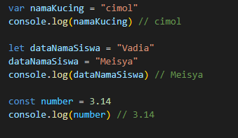
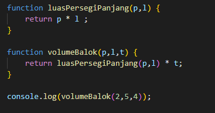

# Tugas Writing Test Week 2

## **Apa itu JAVASCRIPT ?**
    Javascript adalah salah satu bahasa pemrograman yang paling populer dan paling banyak digunakan oleh programmer.
    Javascript juga dapat membuat website menjadi interaktif dan dinamis.

    
## **Tipe Data pada Javascript**
1. Number :  tipe data number adalah tipe data yang mengandung semua angka termasuk angka desimal
- Contoh :

   

2. String : merupakan kumpulan dari karakter dan diawali dengan tanda kutip **""** atau **''**
 - Contoh

     

3. Boolean : adalah tipe data yang hanya memiliki dua nilai yaitu **true** dan **false**
    - **true** yang bernilai benar
    - **false** yang bernilai salah

    Contoh :

     

4. Null : yaitu sebuah nilai yang kosong atau menunjuk pada nilai yang tidak ada
5. Undefined : menandakan kondisi variabel yang belum diberi sebuah nilai.
- Contoh : 

    

6. Object : sebuah kumpulan pasangan properti dan nilai. Seperti objek dalam kehidupan sehari-hari. Tipe data object dapat menyimpan data dengan berbagai macam tipe data (number, string, boolean, dan lainnya)
- Contoh :

    

### *Variabel* : adalah sebuah container/tempat untuk menyimpan sebuah nilai.
=> Ada 3 cara mendefinisikan variabel :
1. var
2. let
3. const

- Contoh Penulisan Variabel

  

  *Note* : 
  - Jika mendeklarasikan variabel menggunakan **const** maka kita tidak dapat merubah nilai di dalam variabel
  - **var** dan **let** hampir sama penggunaanya, tetapi dianjurkan menggunakan **let** untuk variabel yang dinamis/dapat diubah

=> Aturan penamaan variabel 
1. Harus mendeskripsikan tentang data yang disimpan
2. Tidak bisa menggunakan number pada awal nama variabel
3. Tidak boleh menggunakan spasi / gunakan camelcase untuk penamaan variabel yang lebih dari satu kata

=> Assigment Operator **(=)** : digunakan untuk menyimpan sebuah nilai pada variabel

=> **Operator Aritmatika (Arithmetic Operator)**
> Operator Aritmatika digunakan di operasi matematika yang melibatkan data dengan tipe number.
Operator-operator tersebut dapat dilihat pada tabel berikut ini :

**Operator**|**Deskripsi**|
|:-----:|:-----:|
|`+`| Penjumlahan|
|`-`| Pengurangan|
|`*`| Perkalian|
|`/`| Pembagian|
|`**`| Eksponen(pangkat) |
|`%`| Modulus(menghasilkan sisa hasil pembagian)|
|`++`| Increment(menambah 1)|
|`--`| Decrement (mengurangi 1)|

Contohnya :

=> **Operator Perbandingan (Comparison Operator)**
> Operator perbandingan digunakan untuk membandingkan dua data atau nilai. Hasil operasi yang melibatkan comparison operator adalah *true* atau *false*

Operator-operator tersebut dapat dilihat dari tabel berikut :

**Operator**|**Deskripsi**|
|:-----:|:-----:|
|`==`| sama dengan(cek nilai) |
|`===`| sama dengan (cek nilai dan tipe data)|
|`!=`| tidak sama dengan (cek nilai)|
|`!==`| tidak sama dengan (cek nilai dan tipe data)|
|`>`| lebih dari |
|`<`| kurang dari|
|`>=`| lebih dari atau sama dengan|
|`<=`| kurang dari atau sama dengan|

Contohnya :

=> **Logical Operator**
> Logical operator (operator logika) digunakan untuk menentukan logika antara dua kondisi atau nilai. Operator logika akan menghasilkan nilai Boolean yaitu *true* atau *false*.

Simbol dari Logical Operator adalah sebagai berikut:
**Operator**|**Deskripsi**|**Output**
|:-----:|:-----:|:-----:|
|`&&`| AND (Dan)| AND akanmenghasilkan nilai *true* jika kedua premis bernilai **true**|
| l l | OR (Atau)| OR akan menghasilkan nilai *true* jika **salah satu** premis mengandung nilai **true**|
|`!`| NOT (Bukan)| NOT akan membalikkan sebuah nilai Boolean. **true** menjadi **false** dan sebaliknya|

- && = AND 
- | | = OR
- ! = NOT

### **Condotional** 
> Conditonal adalah statement percabangan yang menggambarkan suatu kondisi. Kemudian kita cek kondisi tersebut *true* or *false*. Jika **true** maka kondisi tersebut dijalankan

> Contoh Conditional
- IF
- IF...ELSE
- IF...ELSE IF

Contoh :

- Truthy and Falsy digunakan untuk mengecek apakah variabel telah terisi namun tidak mementingkan nilainya.
- Switch Case digunakan jika kondisi dan percabangan terlalu banyak
    - Contoh :

    

    => *dari kasus di atas hasilnya console.log nya yaitu **pakai baju batik***

- Ternary Operator merupakan short-syntax dari statement if..else.

### **Looping**
> Looping adalah statement yang mengulang sebuah instruksi hingga kondisi terpenuhi. Jadi code akan dijalankan berulang kali sampai batas yang ditentukan.

Macam-macam Looping, yaitu :

1. Foor Loop 
- Contoh

    

2. While Loop
- Contoh

    

3. Do while Loop
- Contoh

    

## **Javascript SCOPE**
> Scope merupakan adalah area/wilayah/tempat untuk mencari dan melakukan sesuatu. Scope di JavaScript biasanya kita buat batasannya menggunakan simbol curly brackets (`{}`)

> Blocks adalah code yang berada di dalam curly braces `{}`

- Variabel scope ada dua jenis, yaitu :
> 1. Variabel Global (Global Scope)
>    artinya variabel yang kita punya atau buat dapat di akses dimanapun dalam suatu file. Variabel global harus dideklarasikan di luar blocks

> 2. Variabel Local (Local Scope)
>   artinya kita mendeklarasikan variabel di dalam blocks seperti pada function, conditional, looping. Variabel hanya dapat di akses di dalam blocks saja. 

## **Javascript FUNCTION**
Beberapa hal terkait dengan function :
- Kita menggunakan function agar code yang sama tidak perlu ditulis berulang, jadi lebih dinamis
- Misalkan kita memiliki banyak variabel dengan kasus yang sama, maka lebih baik kita menggunakan function. Jadi kita bisa membuat rumus yang sama untuk variabel yang berbeda.
- Fungsi dapat *berdiri sendiri* atau *disimpan* di dalam sebuah variabel
- Yang menjadi *parameter* yaitu nilai yang nilainya akan berubah-ubah

### Mendeklarasikan Fungsi
Berikut cara mendeklarasikan fungsi

suatu fungsi itu memiliki nama fungsi, parameter, dan hasil (return value)

>parameter adalah syarat input yang harus dimasukkan ke dalam suatu fungsi dan dideklarasikan bersama dengan deklarasi fungsi. 

>argument adalah nilai yang dimasukan ke dalam suatu fungsi, sesuai dengan persyaratan parameter, di mana argument dituliskan bersamaan dengan pemanggilan fungsi.

Contoh penulisan function

    parameter dari fungsi di atas yaitu p dan l
    argument nya adalah angka 2 dan 5

> Default Parameter digunakan untuk memberikan nilai awal/default pada parameter function

Contohnya :

>- **Console.log** hanya menampilkan informasi ke dalam tab console Javascript
>- **return** akan mengembalikan sebuah nilai ke tempat dimana fungsi itu dipanggil

#### **Function Helper**
Kita bisa menggunakan function yang sudah dibuat pada function lain

Contohnya :

#### **Arrow Function**
>Arrow function adalah cara lain menuliskan function.

Contoh penulisan *arrow function* :

## **Javascript Data Type Built in Prototype**

Di dalam javascript kita memiliki beberapa type data :

**A. Type Data PRIMITIV**
>Primitiv value = nilai yang sifatnya TUNGGAL
- contoh : let nilai = 1
1. Number 
2. String
3. Boolean
4. Null
5. Undefined
6. BigInt (integer)
7. Symbol

**B. Type Data Object**
>Data type object ini data yang riil langsung ada di sekitar kita seperti orang, hewan, mobil

Contohnya :

    person : adalah nama object
    name, age, hobby: adalah attribute dari object
    Vadia, 14, painting : adalah value dari attribut

### Cek Tipe Data
>Untuk mengecek type data yaitu dengan cara berikut:

## **Javascript DOM**
>DOM (Document Object Model)

